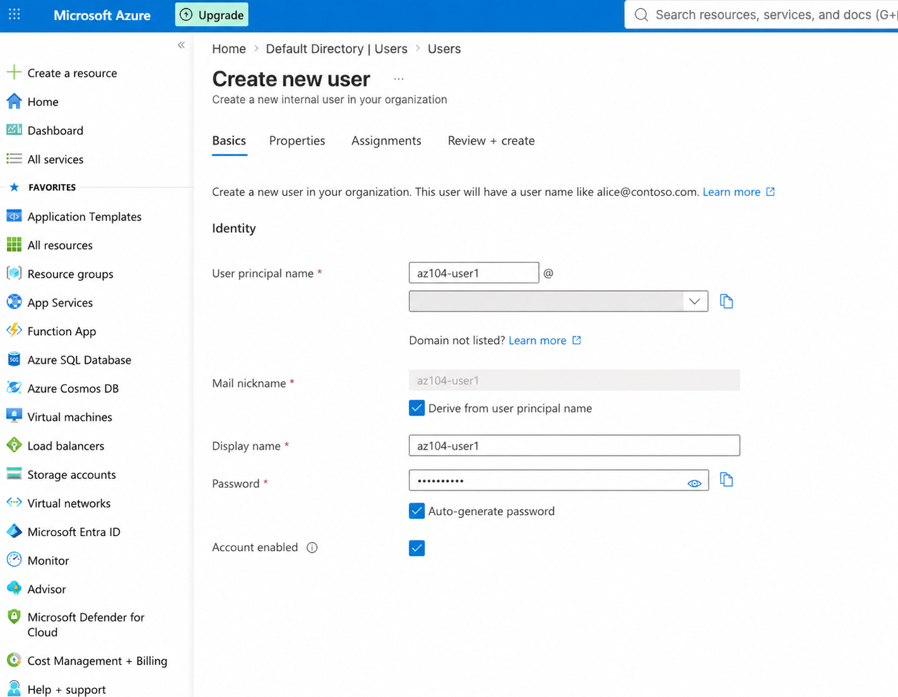
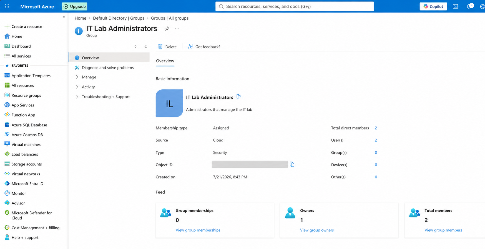
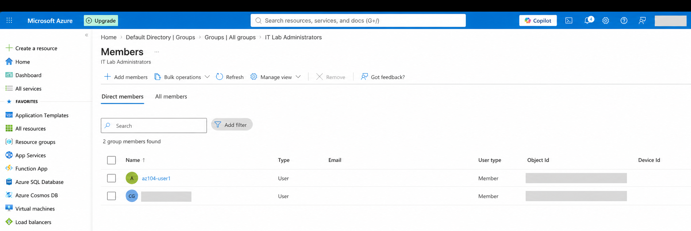

# Lab 1: Manage Microsoft Entra ID Identities

[← Back to the lab index](../README.md)

## Objective

Create and manage internal users, guest users, and security groups in Microsoft Entra ID. These identities are the foundation for controlling who can access Azure resources.

## What I completed

1. Explored the Microsoft Entra ID tenant and its identity-management features.
2. Created an internal user named `az104-user1` with the job title **IT Lab Administrator**, department **IT**, and usage location **United States**.
3. Invited an external user as a guest and assigned the same basic profile information.
4. Created an assigned security group named `IT Lab Administrators`.
5. Set myself as the group owner and added both the internal and guest users as members.

## Lab evidence

### Internal user creation

### Security group overview

### Assigned group members

## Key takeaways

- A **tenant** is an organization's dedicated Microsoft Entra ID instance containing its users, groups, and other identity objects.
- **Member users** normally belong to the organization, while **guest users** provide controlled access for external collaborators.
- **Security groups** simplify access management by allowing permissions and Azure RBAC roles to be assigned to a group instead of separately to every user.
- **Assigned membership** is maintained manually. **Dynamic membership** automatically updates members from user or device attributes and requires Microsoft Entra ID Premium P1 or P2.

## Real-world administrator perspective

An experienced Azure administrator manages access through groups whenever possible. For example, the `IT Lab Administrators` group could receive an Azure RBAC role on a lab resource group, allowing administrators to add or remove engineers without repeatedly changing permissions on individual Azure resources.
