# Lab 2: Manage Subscriptions, RBAC, and Azure Policy

[← Back to the lab index](../README.md)

## Objective

Organize Azure subscriptions with management groups, delegate access through Azure role-based access control (RBAC), and enforce resource-governance standards with tags, Azure Policy, remediation tasks, and resource locks.

## Lab 2A: Manage Subscriptions and RBAC

### What I completed

1. Created the `az104-mg1` management group to provide a shared scope for subscriptions, RBAC assignments, and policy inheritance.
2. Reviewed Azure built-in roles and assigned **Virtual Machine Contributor** to the `helpdesk` group at the management-group scope.
3. Created the **Custom Support Request** role by cloning **Support Request Contributor**.
4. Excluded the permission to register the Microsoft Support resource provider, adding it as a `NotAction` to follow least privilege.
5. Set the management group as the custom role's assignable scope.
6. Reviewed the management group's Activity Log to monitor role-related administrative changes.

### Lab evidence

#### Management-group hierarchy

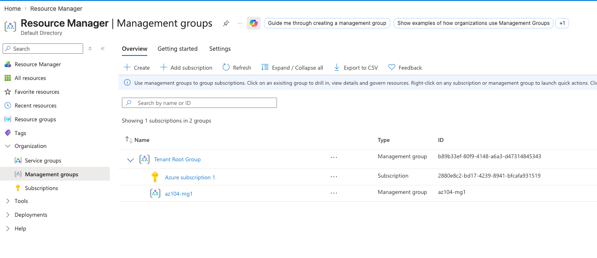

#### RBAC role assignment

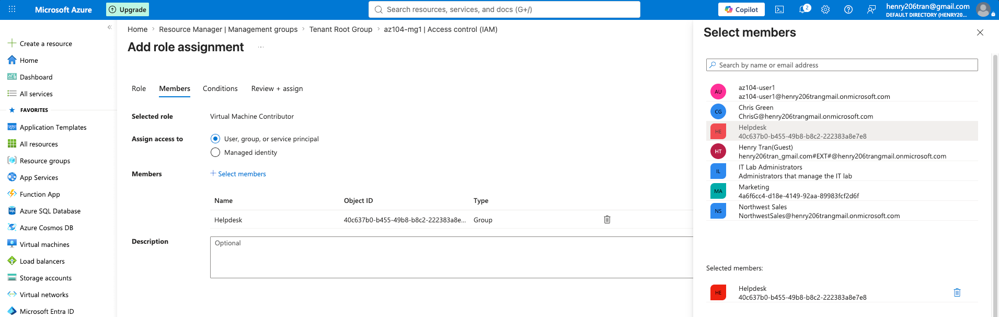

#### Custom support role

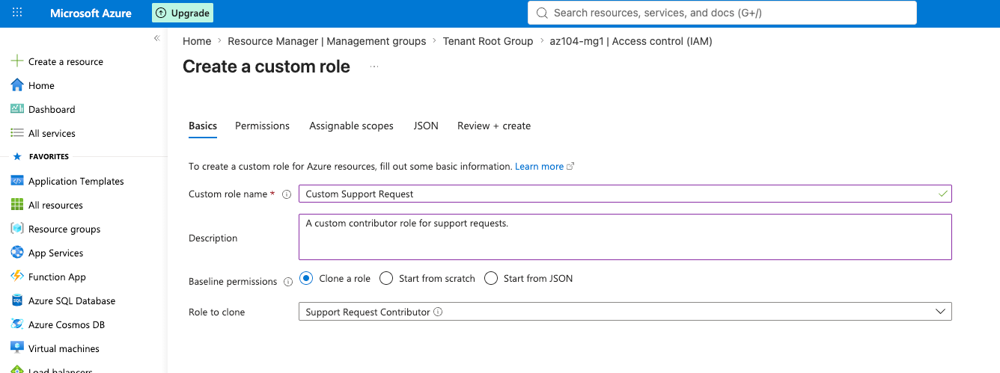

#### Activity Log review

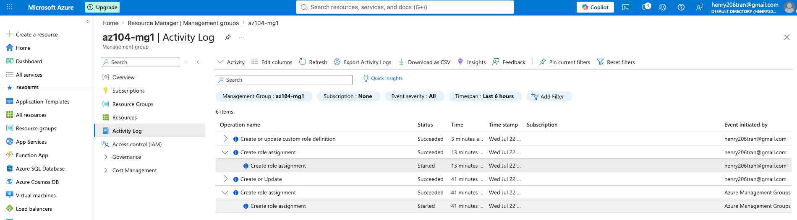

## Lab 2B: Manage Governance via Azure Policy

### What I completed

1. Created the `az104-rg2` resource group in **East US** and added the tag `Cost Center: 000`.
2. Assigned the built-in **Require a tag and its value on resources** policy at the resource-group scope.
3. Configured the policy to require the `Cost Center` tag with the value `000`.
4. Verified the policy's `Deny` behavior when an untagged storage-account deployment failed validation.
5. Replaced the deny policy with **Inherit a tag from the resource group if missing**.
6. Enabled a remediation task and its managed identity so resources could receive the missing tag through the policy's `Modify` effect.
7. Deployed a storage account without manually supplying the tag and verified that it inherited `Cost Center: 000`.
8. Added the `rg-lock` delete lock to `az104-rg2` and confirmed that Azure blocked an attempted resource-group deletion.

### Lab evidence

#### Resource-group tag

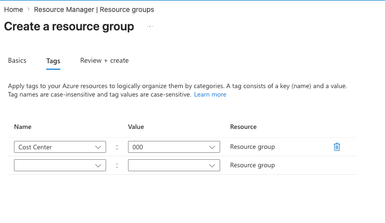

#### Required-tag policy

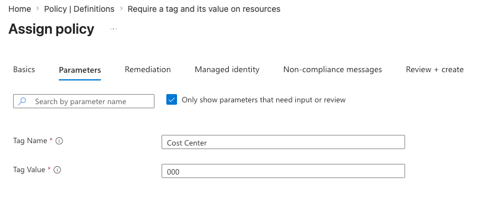

#### Non-compliant deployment denied

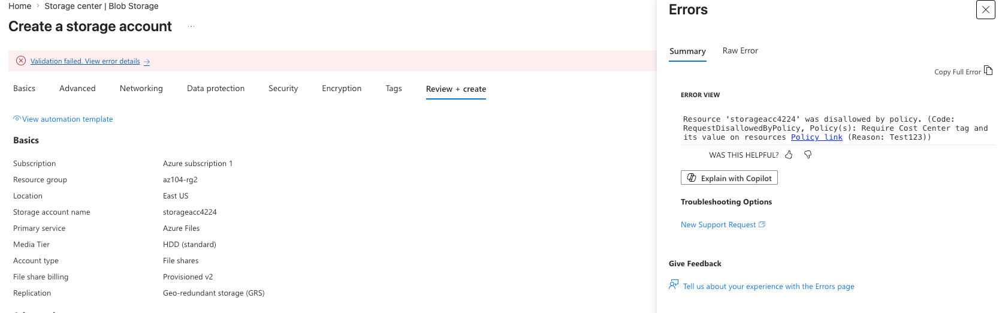

#### Policy remediation

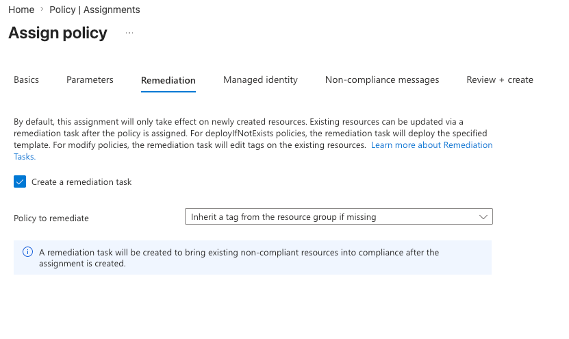

#### Tag inherited by the resource

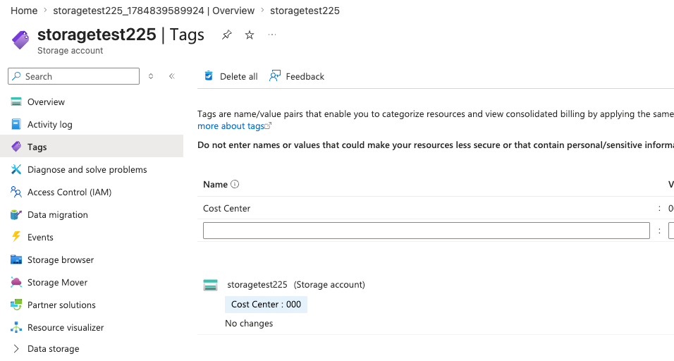

#### Resource lock

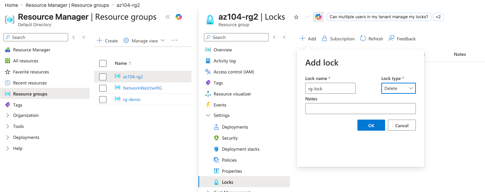

#### Locked deletion blocked

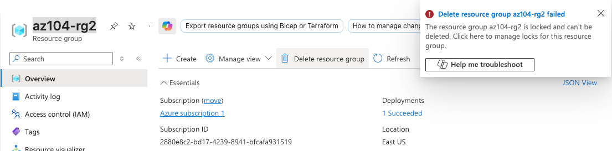

## Key takeaways

- **Management groups** provide a scope above subscriptions. RBAC assignments and Azure Policy assignments made there can be inherited by child management groups, subscriptions, resource groups, and resources.
- **Azure RBAC** answers: *Who can do what, and at which scope?* Assigning roles to groups makes access easier to manage than assigning the same role to individual users.
- Built-in roles cover common scenarios. **Custom roles** support least privilege when a built-in role grants more permissions than a team needs.
- A custom role definition uses `Actions`, `NotActions`, and `AssignableScopes`. A `NotAction` removes a permission from that role; it is not an explicit deny if another role grants the same permission.
- **Tags** are key-value metadata used for ownership, cost allocation, automation, reporting, and lifecycle management.
- **Azure Policy** evaluates resource configuration. A `Deny` effect blocks a non-compliant request, while a `Modify` effect can add or update properties such as tags.
- Existing non-compliant resources are not automatically fixed just because a policy is assigned. A **remediation task** applies supported policy changes to those resources, and `Modify` commonly requires a managed identity.
- A **CanNotDelete** lock blocks deletion at its scope and is inherited by child resources. Even an Owner must remove the lock before deleting the protected resource.
- The **Activity Log** provides an audit trail for Azure Resource Manager operations, including changes to role assignments and other administrative actions.

## Real-world administrator perspective

An experienced Azure administrator designs governance from the top down. Management groups reflect the organization's structure, and RBAC roles are assigned to Microsoft Entra groups at the narrowest practical scope. Privileged access is kept eligible and time-bound when Microsoft Entra Privileged Identity Management is available.

Policies are normally tested with an audit effect before enforcement, then rolled out at a management-group or subscription scope with documented exclusions. Administrators regularly review compliance, run remediation tasks, monitor the Activity Log, and protect critical production resources with `CanNotDelete` locks. Together, RBAC, Azure Policy, and resource locks provide different layers of control:

| Control | Main question | Example from this lab |
| --- | --- | --- |
| Azure RBAC | Who can perform an action? | The `helpdesk` group can manage virtual machines. |
| Azure Policy | Is the resource configured according to standards? | Resources must contain or inherit the `Cost Center` tag. |
| Resource lock | Can the resource be changed or deleted? | `az104-rg2` cannot be deleted until its lock is removed. |

## Microsoft Learn resources

- [What are Azure management groups?](https://learn.microsoft.com/azure/governance/management-groups/overview)
- [What is Azure role-based access control (Azure RBAC)?](https://learn.microsoft.com/azure/role-based-access-control/overview)
- [What is Azure Policy?](https://learn.microsoft.com/azure/governance/policy/overview)
- [Lock your Azure resources to protect your infrastructure](https://learn.microsoft.com/azure/azure-resource-manager/management/lock-resources)
